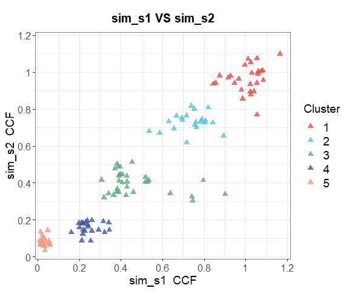
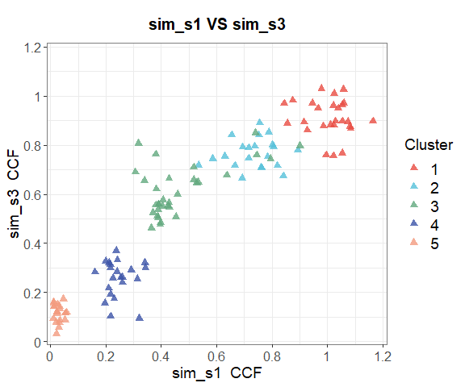
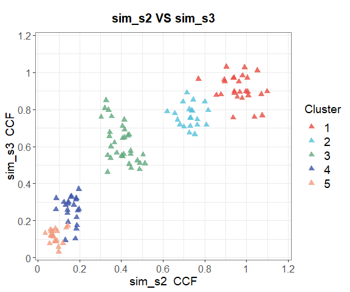
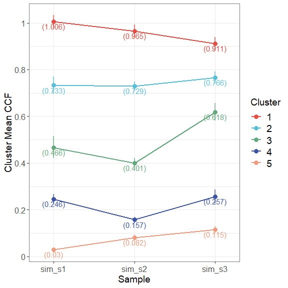
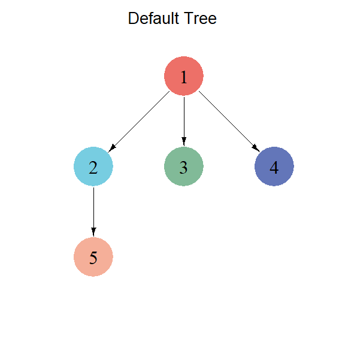
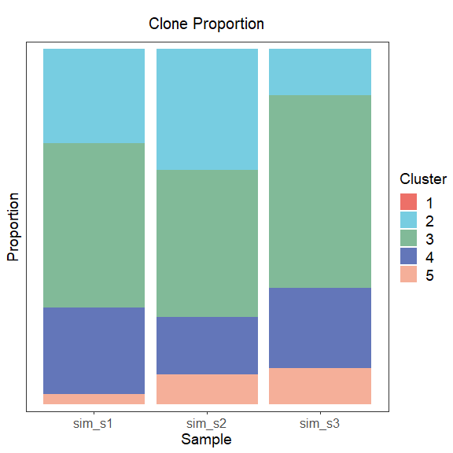

<!-- README.md is generated from README.Rmd. Please edit that file -->

# RETCHER

<!-- badges: start -->
<!-- badges: end -->

RETCHER is a method for inferring tumor clonal evolution and
heterogeneity based on bulk tumor DNA sequencing data. It reconstructs
the tumor subclonal structure using the cancer cell fraction (CCF) of
somatic mutations, infers clonal evolution trees, and constructs
phylogenetic trees based on the presence of mutations in samples.
RETCHER provides a step-by-step mode for running from input files to all
results, as well as a pipeline for quick execution.

## Installation

The subclonal clustering part of RETCHER is based on
[sciClone](https://github.com/genome/sciclone)’s variational Bayesian
mixture model. Make sure you have installed the
[sciClone](https://github.com/genome/sciclone) package. Then you can
install RETCHER with the following:

``` r
# install.packages("devtools")
devtools::install_github("zlsys3/RETCHER")
```

If you haven’t installed [sciClone](https://github.com/genome/sciclone)
yet, you can still install RETCHER first and then use the following
function to automatically install
[sciClone](https://github.com/genome/sciclone):

``` r
library(RETCHER)
install_sciClone()
```

## Usage

### input

The input data of RETCHER is a *list* of *data.frame*, where each
*data.frame* represents a sample, and each sample must have 8 columns of
data:

| columns | description                                                  |
|:--------|:-------------------------------------------------------------|
| chr     | The chromosome name of the mutation                          |
| pos     | The position of the mutation                                 |
| gene    | The identifier of the mutation                               |
| ref     | The number of reads for the reference allele of the mutation |
| alt     | The number of reads for the alternate allele of the mutation |
| major   | The major copy number of the mutation                        |
| minor   | The minor copy number of the mutation                        |
| purity  | The purity of the sample                                     |

Allelic read counts for somatic mutations can be derived from
[Mutect2](https://gatk.broadinstitute.org/hc/en-us/articles/360037593851-Mutect2),
and allele-specific copy numbers and purity can be derived from
[facets](https://github.com/mskcc/facets). Of course, any other tool
will do, as long as it gets data consistent with the requirements.

### output

The output of RETCHER has three main parts:

- **Cluster:** Includes clustering results; confidence intervals for
  subclonal clusters; mutation multiplicity and CCF for each mutation in
  each sample; grouping results for whether mutations are present in the
  sample, and CCF for each group.

``` r
# Clustering results
head(cluster_res$mat)
#>    chr pos   gene sim_s1.var sim_s2.var sim_s3.var sim_s1.depth sim_s2.depth
#> 1 chr1   1  gene1         99         83         77          203          193
#> 2 chr1  10 gene10         86         67         75          194          174
#> 3 chr1  16 gene16         89         87         96          202          214
#> 4 chr1  30 gene30         82         85         74          199          195
#> 5 chr1  23 gene23         97         80         46          211          190
#> 6 chr1  11 gene11        102        121         80          215          207
#>   sim_s3.depth sim_s1.ccf sim_s2.ccf sim_s3.ccf cluster
#> 1          197     1.0837     0.9557     0.8686       1
#> 2          190     0.9851     0.8557     0.8772       1
#> 3          207     0.9791     0.9034     1.0306       1
#> 4          184     0.9157     0.9687     0.8937       1
#> 5          196     1.0216     0.9357     0.7562       1
#> 6          198     1.0543     0.9418     0.8979       1
```

- **Tree:** Includes the adjacency matrix of the containment
  relationships between clusters; the default clonal evolutionary tree;
  all the evolutionary trees that satisfy the condition; the weights for
  ranking all the evolutionary trees; and the proportion of subclones
  for each sample.

``` r
# All possible clonal evolutionary trees and
# have been ordered according to the total edge probability.
head(sortedAllTree$tree_list, 3)
#> $Tree1
#>   parent child
#> 1      1     2
#> 2      2     3
#> 3      1     4
#> 4      2     5
#> 
#> $Tree2
#>   parent child
#> 1      1     2
#> 2      2     3
#> 3      3     4
#> 4      3     5
#> 
#> $Tree3
#>   parent child
#> 1      1     2
#> 2      2     3
#> 3      2     4
#> 4      3     5
```

- **Plot:** Visualization of all results.





## Quick start

You can get a quick start using the demo data provided by RETCHER
following these instructions:

    library(RETCHER)

    data(simdata)
    head(simdata$sim_s1)

    pipeline_res <- RunPipeline(inputList = simdata)
    # or
    pipeline_res <- RunPipeline(inputList = simdata, saveDir = "./results")

If you specify `saveDir`, RETCHER will generate three folders in the
directory, corresponding to the three parts of the output results. If
`saveDir` is not set, RETCHER will output all visualization images in
RStudio.

## Notes

In addition to running the pipeline, RETCHER can also run each part step
by step. You can view the step-by-step operation and more parameter
descriptions in the demo code we provide. Open the *demo.R* file with
the following command：

`file.edit(system.file("demo","demo.R",package = "RETCHER"))`
